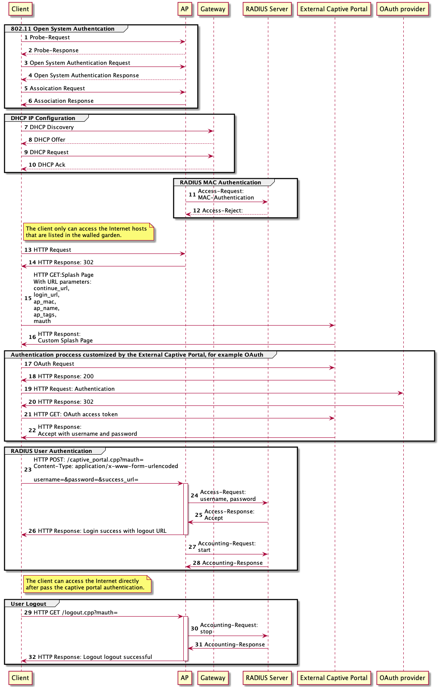
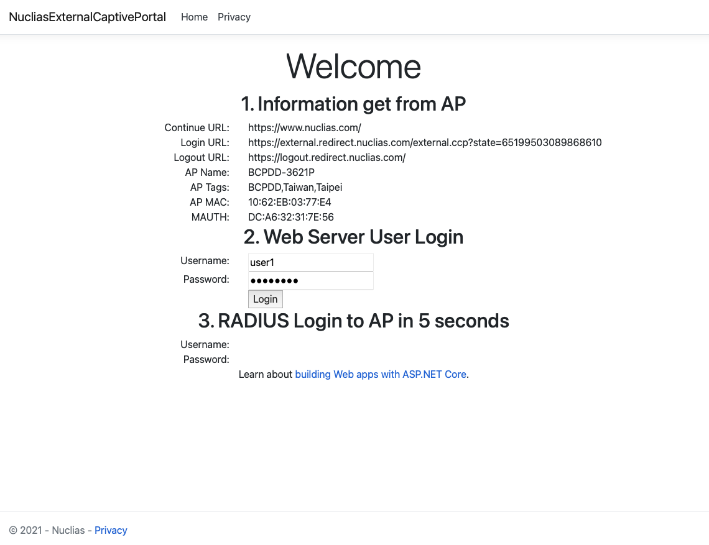

# Nuclias External Captive Sample Server

This sample code play as a simple External Captive Portal Web Server
as a participant of steps 13 - 26 in the following flow chart.

13. An unauthorized user opens the browser and tries to access the Internet.
    AP intercepts the request from the browser to the Internet Web Server.
1. AP response a redirect instruction with the information to the browser.
1. The browser brings the information to the External Captive Portal Web Server.
1. External Captive Portal Web server returns a custom Splash Page to the browser.

17-22. User authentication processes.

External Captive Portal can redirect authentication requests to the other
OAuth servers or check from its own user database.

22. External Captive Portal Web Server delivered the RADIUS user credentials for accessing AP's authentication to the browser.
1. The browser sends the RADIUS user credentials to the AP through the login_url endpoint.
1. AP forwards the RADIUS user credentials to the RADIUS server for asking if the user is accepted to access the network.
1. RADIUS server response Accept to the AP for allowing the user to access the network.
1. AP returns the login success message with the logout URL to the browser, and the browser redirects to the success_url.

## Sample Codes

| Filename                                 | Description                                                  |
| ---------------------------------------- | ------------------------------------------------------------ |
| [Index.cshtml](http://bit.ly/3tjVxuQ)    | External Captive Portal Landing Page View Template           |
| [Index.cshtml.cs](http://bit.ly/3cyoQUC) | Landing Page Controller                                      |
| [Startup.cs](http://bit.ly/39CfcOQ)      | Startup class and [Login API](http://bit.ly/3tfyRff) Example |

## Example

The [Landing page](http://bit.ly/3j6x87k) of this External Captive Portal Web Server Example shows the information get from the AP in section 1.

Section 2 is a web form with the default username and password of passing the Web Server's user authentication.
Click the Login button the user credentials of the Web Server send to the Login API for checking if it is a valid user.

If it is a valid user, in section 3 the Web Server returns valid RADIUS user credentials for the browser to send to
the AP to pass the authentication and access the network.

